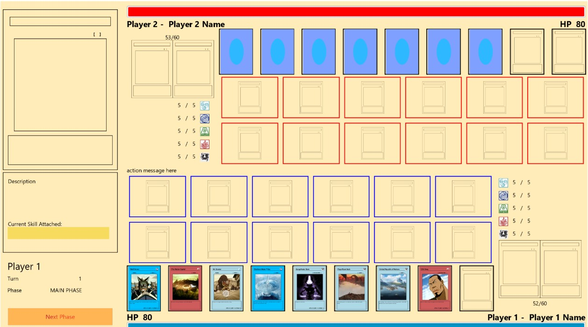
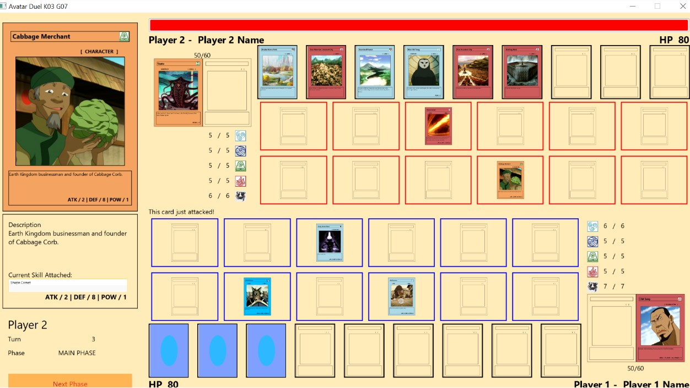

# Avatar Duel game
Avatar Duel is about strategy card game with GUI similar with Yu Gi Oh! or Magic: The Gathering. This project is made with Java language, JavaFX for GUI and also use Object-Oriented Programming.

## Screenshots
 


## Structure 
```
src
└───main
    ├───java
    │   └───com
    │       └───avatarduel
    │           │   AvatarDuel.java
    │           │   Paths.java
    │           │   PlayerInfo.java
    │           │   Settings.java
    │           │
    │           ├───event
    │           │       EventType.java
    │           │       Subscriber.java
    │           │
    │           ├───exception
    │           │       AlreadySummonedLand.java
    │           │       CannotAttackException.java
    │           │       CannotSummonCardException.java
    │           │       FieldCellIsOccupiedException.java
    │           │       JustAttackedException.java
    │           │       JustSummonedException.java
    │           │       NoCharaterOnFieldException.java
    │           │       NotEnoughPowerException.java
    │           │       NotImplementedException.java
    │           │       NotInAttackStanceException.java
    │           │       NotStrongEnoughException.java
    │           │       WrongRowException.java
    │           │
    │           ├───model
    │           │   │   BoardController.java
    │           │   │   GameEventHandler.java
    │           │   │   GameInfo.java
    │           │   │   HasCardController.java
    │           │   │   Location.java
    │           │   │
    │           │   ├───card
    │           │   │   │   Card.java
    │           │   │   │   CardController.java
    │           │   │   │   CardDescController.java
    │           │   │   │   CardType.java
    │           │   │   │   SelectedCard.java
    │           │   │   │   SummonedCardController.java
    │           │   │   │
    │           │   │   ├───land
    │           │   │   │       Land.java
    │           │   │   │
    │           │   │   └───summonable
    │           │   │       │   CardSummoner.java
    │           │   │       │   EmptyCard.java
    │           │   │       │   Summonable.java
    │           │   │       │   SummonableCard.java
    │           │   │       │   SummonedCard.java
    │           │   │       │   SummonedCharacterCard.java
    │           │   │       │   SummonedEmptyCard.java
    │           │   │       │   SummonedSkillCard.java
    │           │   │       │
    │           │   │       ├───character
    │           │   │       │       Character.java
    │           │   │       │
    │           │   │       └───skill
    │           │   │               Aura.java
    │           │   │               Destroy.java
    │           │   │               PowerUp.java
    │           │   │               Skill.java
    │           │   │
    │           │   ├───element
    │           │   │       Air.java
    │           │   │       Earth.java
    │           │   │       Element.java
    │           │   │       Energy.java
    │           │   │       Fire.java
    │           │   │       NoElement.java
    │           │   │       Water.java
    │           │   │
    │           │   ├───phase
    │           │   │       Phase.java
    │           │   │       PhaseController.java
    │           │   │
    │           │   └───player
    │           │       │   CanShowCard.java
    │           │       │   PlayerAttributeController.java
    │           │       │   PlayerController.java
    │           │       │   PlayerInventoryController.java
    │           │       │   PowerController.java
    │           │       │
    │           │       ├───field
    │           │       │       FieldController.java
    │           │       │
    │           │       └───hand
    │           │               HandController.java
    │           │
    │           └───util
    │                   BackgroundLoader.java
    │                   CardDAO.java
    │                   CSVReader.java
    │                   ImageLoader.java
    │                   Pair.java
    │
    └───resources
        └───com
            └───avatarduel
                ├───card
                │   ├───data
                │   │       aura.csv
                │   │       character.csv
                │   │       destroy.csv
                │   │       land.csv
                │   │       powerup.csv
                │   │
                │   └───image
                │       │
                │       ├───aura
                │       │
                │       ├───character
                │       │
                │       ├───destroy
                │       │
                │       ├───element
                │       │
                │       ├───land
                │       │
                │       └───powerup
                │
                ├───css
                │       root.css
                │
                └───fxml
                        Board.fxml
                        Card.fxml
                        CardBack.fxml
                        CardDesc.fxml
                        Field1.fxml
                        Field2.fxml
                        Hand.fxml
                        Phase.fxml
                        Player1.fxml
                        Player2.fxml
                        PlayerAttribute1.fxml
                        PlayerAttribute2.fxml
                        PlayerInventory1.fxml
                        PlayerInventory2.fxml
                        Power1.fxml
                        Power2.fxml
```               
## Prerequisite
1. [Java 1.8](https://www.oracle.com/java/technologies/javase-jdk8-downloads.html)

## Compiling and Running
1. Open terminal and go to Avatar-Duel directory
1. For Windows type `gradlew run` and for Linux type `./gradlew run`
1. It will open the game in a new window

## Created by
This program is created by:
- [Jovan Karuna Cahyadi](https://github.com/JovanKaruna)    / 13518024
- [Byan Sakura Kireyna Aji](https://github.com/bsakura) / 13518066
- [Daniel Riyanto](https://github.com/Daniel-Ri)          / 13518075
- [Jonathan Yudi Gunawan](https://github.com/JonathanGun)   / 13518084
- [Evan Pradanika](https://github.com/DufanGratis)        /13518126

## Knowledgment
This project is used to fulfill our assignment given by IF2210 subject as foundation for us in order to have a better understanding for Object Oriented Programming. 

## Credit
All images and description are taken from [Avatar Wikia](https://avatar.fandom.com/wiki/Avatar_Wiki)

